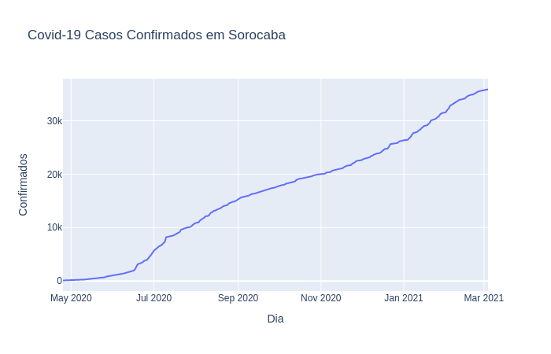
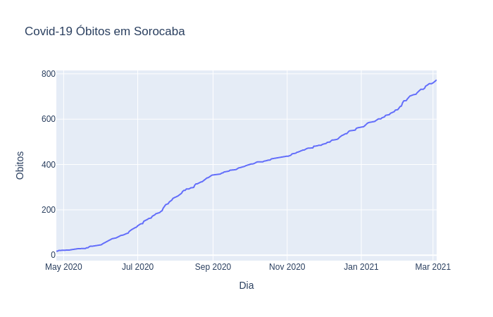

## Dados divulgados pela Prefeitura de Sorocaba sobre os casos de Covid-19
### última atualização: 04/02/2021

Há uma planilha com os dados retirados das imagens divulgadas [AQUI](https://github.com/lucas-koiti/covid19-sorocaba/blob/master/dados/planilha_csv/dados.csv).

### Taxa de Letalidade
2.15% 

## Gráfico de casos confirmados.

## Gráfico de óbitos por covid-19.

